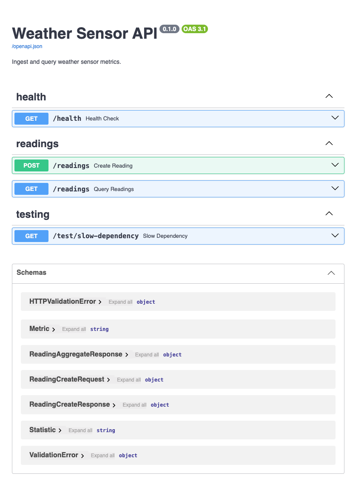
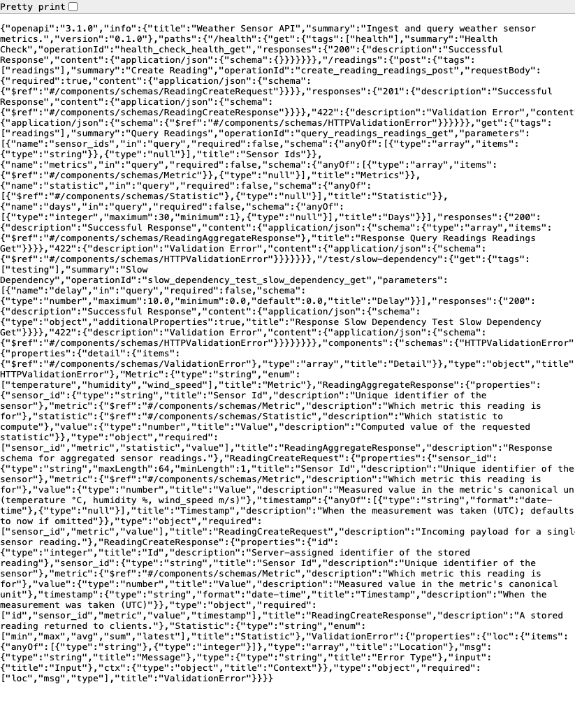

# Weather Sensor REST API

[](https://github.com/kbarry91/s7m4q9v2/actions/workflows/ci.yml)

A REST API that ingests weather metrics from sensors (temperature, humidity, wind
speed, ...) and lets you query the latest readings or aggregate a lookback period.

Built with **FastAPI** (async) and **SQLite** (swappable to PostgreSQL).

## Requirements

- Python 3.11 or newer (developed on 3.14)
- Docker desktop to run create docker image and run docker container

Development and testing were performed on macOS 26.7.1 with Python 3.14.5.

## Project structure

```
app/
  main.py            # app entry point and router registration
  rate_limiter.py    # in-memory token-bucket rate limiting
  routers/           # HTTP layer and endpoint definitions
    health.py
    readings.py
    resilience_demo_router.py
  services/          # business logic and fake test dependency
    query_service.py
    fake_slow_dependency_service.py
  config.py          # environment-based configuration
  persistence/       # database engine, ORM models, and repositories
    db.py
    models.py
    repository.py
  schemas.py         # Pydantic request and response models
tests/
  unit/              # isolated logic tests
    test_config.py
    test_query_service.py
    test_rate_limiter.py
  integration/       # FastAPI, validation, and SQLite tests
    test_health_endpoint.py
    test_readings_ingestion.py
    test_readings_queries.py
    test_resilience_endpoints.py
assets/               # API documentation and load-test evidence
  openapi-json.png
  swagger-ui.png
  load-test-reading.json
  load-test-results.md
Dockerfile             # container image definition
.dockerignore          # files excluded from the image build context
.github/workflows/ci.yml # automated test workflow
requirements.txt     # runtime dependencies
requirements-dev.txt # development and test dependencies
pytest.ini           # pytest discovery configuration
```


## Setup
### MAC OS
Clone the repo, then from the project root:

```bash
# 1. Create an isolated virtual environment
python3 -m venv .venv

# 2. Activate it
source .venv/bin/activate

# 3. Install dependencies (pinned in requirements.txt for reproducibility)
pip install -r requirements.txt
```

To reproduce this environment on macOS, repeat the three steps above. The pinned
`requirements.txt` guarantees the same package versions.

For development and testing, install the additional tools with:

```bash
pip install -r requirements-dev.txt
```

### Docker

Docker Desktop lets the API run the same way on macOS or Windows:

```bash
docker build -t weather-sensor-api .
docker run --rm -p 8000:8000 -v weather-api-data:/app/data weather-sensor-api
```

The named volume keeps the SQLite database when the container stops. The API is
available at `http://127.0.0.1:8000`.

## Running the API

| Command | macOS |
|---|---|
| Start API | `uvicorn app.main:app --reload` |
| Run all tests | `.venv/bin/python -m pytest tests -q` |

Run these commands after activating the virtual environment. The SQLite database is
created as `weather.db` in the project root on first startup.

- API base URL: http://127.0.0.1:8000
- Interactive docs (Swagger UI): http://127.0.0.1:8000/docs
- Alternative docs (ReDoc): http://127.0.0.1:8000/redoc

The `--reload` flag restarts the server automatically when you edit code (dev only).

## API documentation

Swagger UI provides interactive documentation at `/docs`:



The generated OpenAPI contract is available at `/openapi.json`:



## Testing

### Unit Testing

```bash
.venv/bin/python -m pytest tests/unit -q
```

Unit tests cover isolated application logic.

### Integration Testing

```bash
.venv/bin/python -m pytest tests/integration -q
```

Integration tests exercise FastAPI, request validation, database persistence, and
endpoint behavior together.

Run the full test suite:

```bash
.venv/bin/python -m pytest tests -q
```

### Load Testing

Load-test commands and results: [assets/load-test-results.md](assets/load-test-results.md).


## Endpoints

### ✅ Implemented endpoints

| Method | Path | Description |
|--------|------|-------------|
| GET | `/health` | Liveness check. Returns `{"status": "ok"}`. |
| POST | `/readings` | Store one reading. Metrics: `temperature`, `humidity`, or `wind_speed`. |
| GET | `/readings` | Return latest readings or aggregate the previous `days=1..30` days. Supports sensor, metric, and statistic filters. |
| GET | `/test/slow-dependency` | Test-only endpoint for timeout and bulkhead exercises. Enabled with `TEST_DEPENDENCY_ENABLED=true`. |

When `days` is omitted, the API returns the latest reading for each selected
sensor/metric pair and reports `"statistic": "latest"`. When `days` is supplied,
the API aggregates all matching readings from that lookback period. The supported
statistics are `min`, `max`, `avg`, and `sum`; the default is `avg`.

### Sample requests and responses

The `curl` examples below are the macOS commands used for testing.

Health check:

```bash
curl 'http://127.0.0.1:8000/health'
```

```json
{"status":"ok"}
```

Store a reading:

```bash
curl -X POST 'http://127.0.0.1:8000/readings' \
  -H 'Content-Type: application/json' \
  -d '{"sensor_id":"sensor-1","metric":"temperature","value":21.4}'
```

Example response:

```json
{
  "id": 12,
  "sensor_id": "sensor-1",
  "metric": "temperature",
  "value": 21.4,
  "timestamp": "2026-10-05T12:00:00"
}
```

Get the latest reading. Omit `days` to return the newest value for each
sensor/metric combination:

```bash
curl 'http://127.0.0.1:8000/readings?sensor_ids=sensor-1&metrics=temperature'
```

Example response:

```json
[
  {
    "sensor_id": "sensor-1",
    "metric": "temperature",
    "statistic": "latest",
    "value": 21.4
  }
]
```

Get an average over the previous eight days:

```bash
curl 'http://127.0.0.1:8000/readings?sensor_ids=sensor-1&metrics=temperature&days=8'
```

Example response:

```json
[
  {
    "sensor_id": "sensor-1",
    "metric": "temperature",
    "statistic": "avg",
    "value": 20.8
  }
]
```

Get the maximum humidity over the previous 30 days:

```bash
curl 'http://127.0.0.1:8000/readings?sensor_ids=sensor-1&metrics=humidity&statistic=max&days=30'
```

Example response:

```json
[
  {
    "sensor_id": "sensor-1",
    "metric": "humidity",
    "statistic": "max",
    "value": 55.2
  }
]
```

Query all sensors and metrics:

```bash
curl 'http://127.0.0.1:8000/readings?statistic=avg&days=30'
```

Query multiple selected sensors. Repeat `sensor_ids` for each sensor:

```bash
curl 'http://127.0.0.1:8000/readings?sensor_ids=sensor-1&sensor_ids=sensor-2&metrics=temperature&statistic=avg&days=30'
```

Example response:

```json
[
  {
    "sensor_id": "sensor-1",
    "metric": "temperature",
    "statistic": "avg",
    "value": 20.8
  },
  {
    "sensor_id": "sensor-2",
    "metric": "temperature",
    "statistic": "avg",
    "value": 10.0
  }
]
```

### Rate limiting

`POST /readings` is protected by a proof-of-concept token bucket:

| Setting | Policy |
|---------|--------|
| Identity | Client IP address |
| Capacity | 5 requests in an initial burst |
| Refill rate | 1 token per second |
| Exceeded limit | HTTP `429 Too Many Requests` |

`GET /health` and `GET /readings` are not rate-limited in this PoC. Clients are
responsible for retrying rejected POST requests, preferably with exponential
backoff. A production implementation should use authenticated API keys and shared
state such as Redis when multiple application workers are deployed.

### HTTP status codes

| Status | Source | Meaning |
|--------|--------|---------|
| `200 OK` | FastAPI/endpoint | Request completed successfully. Used by health checks, queries, and the enabled test endpoint. |
| `201 Created` | Application | A reading was accepted and persisted by `POST /readings`. |
| `404 Not Found` | Application or FastAPI | The test endpoint is disabled, or the requested route does not exist. |
| `405 Method Not Allowed` | FastAPI | The route exists, but the HTTP method is not supported. |
| `422 Unprocessable Entity` | FastAPI/Pydantic | Request validation failed, such as an invalid metric, statistic, `days` value, delay, or request body. |
| `429 Too Many Requests` | Application | The client IP exhausted the `POST /readings` token bucket. The response includes `Retry-After: 1`. |
| `503 Service Unavailable` | Application | The test dependency bulkhead has no available slot. |
| `504 Gateway Timeout` | Application | The test dependency exceeded the configured timeout. |
| `500 Internal Server Error` | FastAPI/server | An unexpected unhandled server error occurred. This is not an expected success path. |

The `404`, `405`, and `422` responses are largely provided by FastAPI's routing and
validation machinery. The `429`, `503`, and `504` responses are explicit resilience
decisions in this PoC.

### Test dependency configuration

The slow-dependency endpoint is for learning and resilience testing only. Enable it
when starting the application:

```bash
TEST_DEPENDENCY_ENABLED=true \
TEST_DEPENDENCY_TIMEOUT_SECONDS=2 \
.venv/bin/uvicorn app.main:app --host 127.0.0.1 --port 8000
```

The endpoint accepts `delay=0..10` seconds. It uses a two-slot bulkhead, returns
`503` when both slots are occupied, and returns `504` when the delay exceeds the
configured two-second timeout. It is not part of the original weather API
requirements.

### PoC limitations

This is intentionally a focused proof of concept. SQLite is used for local
persistence, integration tests use the local database with isolated test identifiers,
and rate-limit state is in memory for one process. The resilience endpoint is a
test-only demonstration, not a production external-service integration. A full list
of production follow-up work and enhancements is documented privately.

## Development status

Proof of concept, built incrementally over 5 days.

- **Day 1**: Planning, framework selection, GET /health ✅
- **Day 2**: Data layer, POST /readings ingest ✅
- **Day 3**: Debugging session, GET /readings query endpoint, latest mode, lookback aggregation, and verification  ✅
- **Day 4**: Local load-test baseline, IP-based token-bucket rate limiting, timeout, bulkhead exercises, and automated tests  ✅
- **Initial PoC**: Complete for the original challenge requirements ✅
- **Future Enhancements**: Conversational AI assistant, PostgreSQL migration, and production observability remain future work
